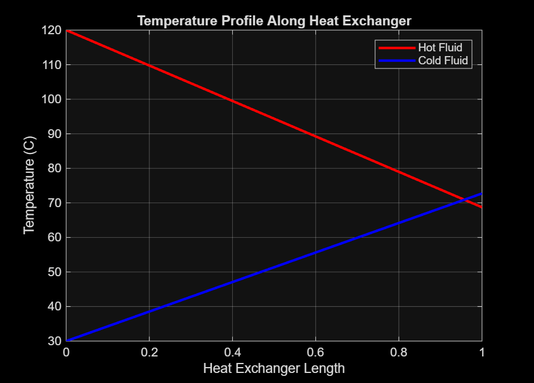
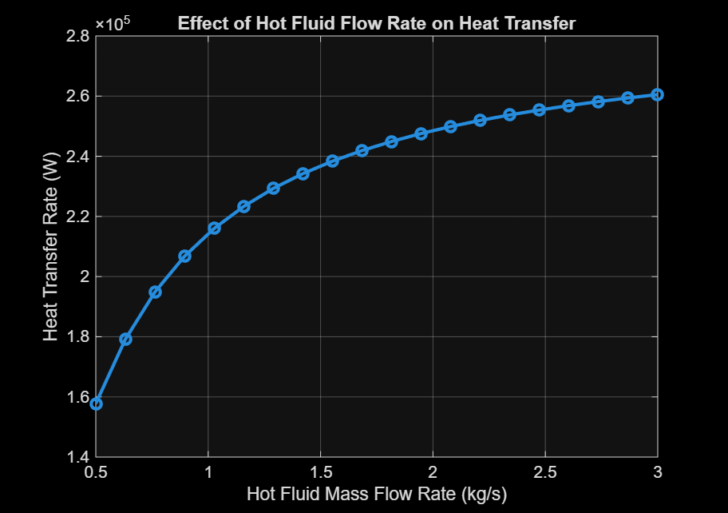

# Heat Exchanger Performance Simulation

This project models the performance of a counter-flow heat exchanger using MATLAB.  
It implements both the **NTU–Effectiveness method** and the **Log Mean Temperature Difference (LMTD) method** to analyze heat transfer and predict outlet temperatures of the hot and cold streams.

## Overview

The simulation evaluates heat exchanger behavior using fundamental heat transfer relations.  
Given fluid flow rates, heat capacities, inlet temperatures, and exchanger parameters, the model calculates:

- heat transfer rate
- outlet temperatures of both fluids
- temperature distribution along the exchanger
- performance trends under different operating conditions

Both classical design approaches used in heat exchanger analysis — **NTU–Effectiveness** and **LMTD** — are implemented and compared.

## What the Model Includes

- Heat capacity rate calculation for hot and cold streams  
- NTU (Number of Transfer Units) calculation  
- Heat exchanger effectiveness estimation  
- Heat transfer rate prediction  
- Outlet temperature calculation for both fluids  
- Temperature profile along the heat exchanger length  
- LMTD-based heat transfer calculation  
- Parametric analysis showing the effect of hot fluid flow rate on heat transfer  

## Results

### Temperature Profile Along Heat Exchanger

### Effect of Hot Fluid Flow Rate on Heat Transfer

## Key Insight

The simulation demonstrates important heat exchanger behavior:

- Increasing the **hot fluid flow rate** increases the heat capacity rate and therefore the **heat transfer rate**.
- NTU and LMTD methods produce consistent results when the exchanger parameters are correctly defined.
- The temperature profile illustrates the typical behavior of a **counter-flow heat exchanger**, where the hot fluid cools while the cold fluid heats up along the exchanger length.

## Tools Used

MATLAB • Heat Transfer • Process Modeling

## Author

Rohit Guleria  
B.Tech Chemical Engineering  
IIT (ISM) Dhanbad