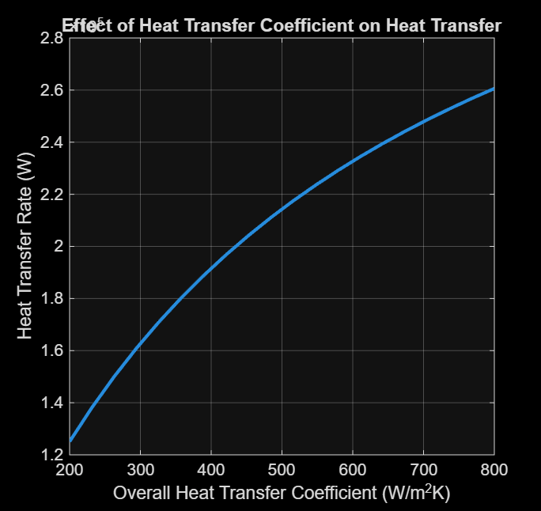
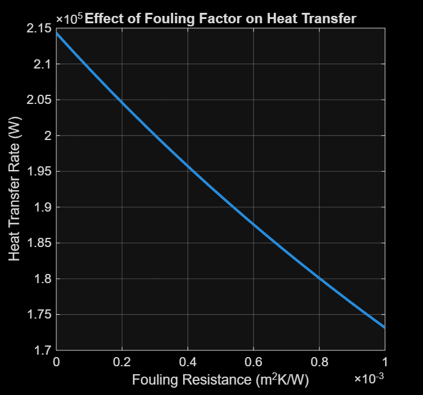

# Heat Exchanger Performance Simulation

This project models the thermal performance of a **counter-flow heat exchanger** using MATLAB. It implements both the **NTU–Effectiveness method** and the **Log Mean Temperature Difference (LMTD) method** to evaluate heat transfer and predict outlet temperatures of the hot and cold streams.

## Overview

The simulation analyzes heat exchanger performance using fundamental heat transfer relations. Given fluid flow rates, inlet temperatures, heat capacities, and exchanger parameters, the model calculates heat transfer rate and outlet temperatures for both fluids.

The project also includes parametric studies to understand how operating conditions and heat transfer properties influence exchanger performance.

## What the Model Includes

- Heat capacity rate calculation for hot and cold streams
- NTU (Number of Transfer Units) calculation
- Heat exchanger effectiveness estimation
- Heat transfer rate prediction
- Outlet temperature calculation for both fluids
- Temperature profile along the heat exchanger
- LMTD-based heat transfer calculation
- Parametric analysis of **hot fluid flow rate**
- Parametric analysis of **overall heat transfer coefficient**
- Parametric analysis of **fouling resistance**

## Results

### Temperature Profile Along Heat Exchanger

### Effect of Hot Fluid Flow Rate on Heat Transfer

### Effect of Heat Transfer Coefficient

### Effect of Fouling Factor

## Key Insight

The simulation demonstrates several important heat exchanger behaviors:

- Increasing **flow rate** increases heat capacity rate and heat transfer.
- Increasing **heat transfer coefficient** improves exchanger performance.
- Increasing **fouling resistance** reduces heat transfer due to added thermal resistance.

These trends reflect real operating challenges in industrial heat exchangers.

## Tools Used

MATLAB • Heat Transfer • Process Modeling

## Author

Rohit Guleria  
B.Tech Chemical Engineering  
IIT (ISM) Dhanbad